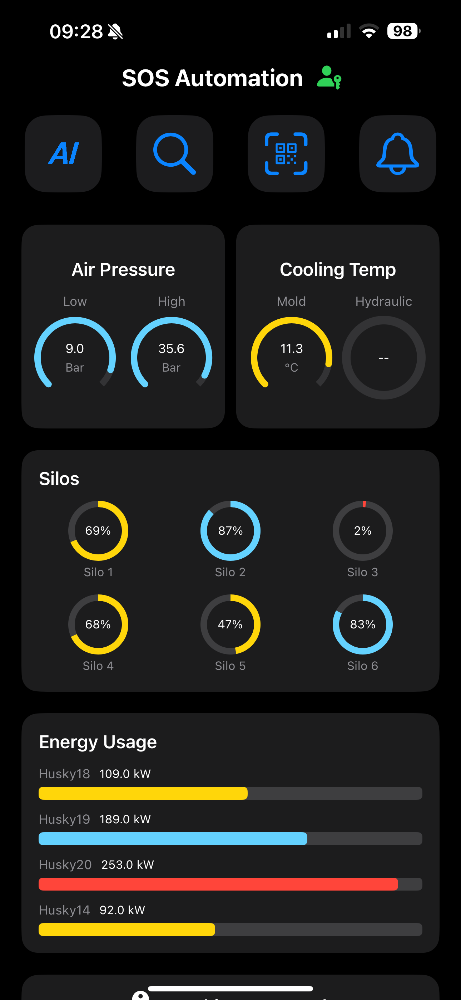

# SOS – SCADA On Smart Devices

**SOS** is a mobile-first SCADA platform I developed to give engineers real-time control and smart tools directly on iPhones and iPads. It connects to PLC systems (like Siemens and Rockwell) and brings factory-level insights to the field — fast, portable, and intelligent.

---

##  App Structure

The SOS app is built around two powerful modules:

---

### 1.  Realtime Monitoring

Live, mobile access to factory operations. Key features include:

-  **Live Equipment Data** – Monitor air & hydraulic pressure, cooling temperatures, and silo levels
-  **Fault Detection** – Automatically detects abnormal conditions (e.g. fire alarms, pressure drops, compressor faults)
-  **Smart Notifications** – Instant alerts when any value goes out of range or a fault is triggered
-  **Designed for Field Engineers** – See system health at a glance, take action on the spot

---

### 2.  Smart Tools & Data Analysis

A digital engineer’s toolbox packed with intelligence:

-  **Energy Consumption Insights** – Hourly, daily, and monthly usage charts per machine
-  **Store Part Search** – Instantly search part data from a live Firebase database
-  **QR Code Scanner** – Scan machine parts to load manuals, metadata, images, and related documents
-  **AI Assistant (GPT-powered)** – Ask natural questions about machines, parts, or fault codes — get instant answers and troubleshooting
-  **PDF Report Generation** – Export energy usage or shift performance reports directly from the app

---

##  Who It's For

- SCADA and automation engineers  
- Factory and utilities technicians  
- Any team needing **mobile, intelligent control** of industrial systems

---

##  Tech Stack

- Swift (iOS native)
- Firebase (Realtime Database + Storage)
- Modbus TCP (for PLC data)
- OpenAI API (for AI assistant)
- QRCodeKit or similar scanner framework

---

##  Screenshots

###  Main Dashboard – SOS ContentView

  

This is the main dashboard of the SOS app. It shows:
- Live air pressure and cooling temperatures
- Real-time silo levels (Silo 1–6)
- Energy usage per machine (e.g., Husky18–20), with color-coded bars
- Fast access to AI Assistant, Store Search, QR Scanner, and Alarms

---

##  About the Developer

Built by **Reza (@Sonovo)** – SCADA Engineer and iOS Developer.  

---

##  License

MIT License – Free to use, fork, and build upon.
